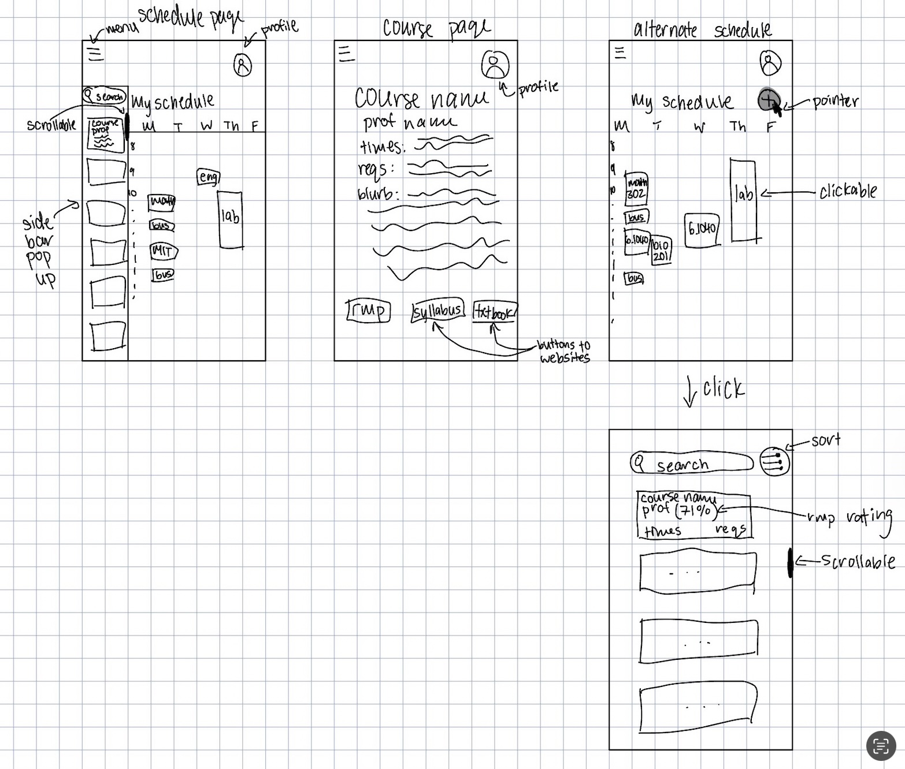

# **Assignment 2**

## **Problem Statement: Course Planning**

### **Problem Domain: Course Planning at Wellesley**
Planning courses is a core part of college life, but at Wellesley it has become unnecessarily
stressful. The registrar’s course browser is now behind a login, making it inaccessible to
external tools like Coursicle, which students once relied on. Workday, the system students must
now use, is confusing, requires multiple permissions to add courses, and offers little support for
planning across time slots or campuses. As a Wellesley student, I have personally struggled
with this process and seen my peers resort to manual spreadsheets, Reddit threads, or
word-of-mouth tips. I care about this because course planning is foundational: it affects our
academic progress, daily schedules, and even our ability to take advantage of cross-registration
opportunities at MIT.

### **Problem: Lack of an Effective Course Planner**
**Wellesley Course Planner: Simple, Powerful UI**  
Students lack a tool that makes course planning fast, intuitive, and reliable. Workday is built for
official registration, not planning, so it overwhelms students with complexity. Without an easy
way to visualize and build schedules, check feasibility (including MIT cross-registration travel
time), and evaluate courses beyond a one-line blurb, students waste hours cobbling together
plans manually, risking mistakes and missed opportunities.

### **Stakeholders**
- **Wellesley Students (Coursicle users)** – previously had a streamlined tool; now forced
  back into clunky systems.
- **Wellesley Students (non-Coursicle users)** – struggle directly with Workday’s poor
  planning interface.
- **Wellesley Administrators/Registrar Staff** – maintain data integrity and privacy; feel
  minimal direct pain but field complaints when students are frustrated.

### **Evidence and Comparables**
1. **Workday incapabilities** – The difficult UI and interface of Workday results in mistakes in
   registration and difficulty creating future class plans.
2. **Reddit Comment (Manual workarounds)** – Many resort to building schedules by hand in
   spreadsheets, which is inefficient and error-prone. [Reddit comment](https://www.reddit.com/r/college/comments/8k101h/comment/dz4557d/)
3. **Low accessibility for 3rd party planning sites** – Wellesley’s course browser itself requires
   login/VPN off-campus, which breaks unauthenticated third-party planners.
4. **Student discussion board** – Comment citing Coursicle as a top option historically,
   highlighting the gap now that it doesn’t support Wellesley. Upvotes back up the comment
   
5. **Direct Student Quotes** – Classmates confirm the need: “Workday is actually so hard to
   use” (Tongtong Ye, ‘27); “I would definitely use something like that, especially if it could
   account for travel times for MIT classes” (Joyce Nishimwe, ‘27)

---

## **Application Pitch**

**Name:** SchedulEZ  
**Motivation:** Students spend hours fighting with Workday or spreadsheets just to make a
feasible schedule. SchedulEZ makes planning fast, simple, and stress-free.

**Key Features:**
1. **Live Course Import** – Each semester, the app scrapes and pulls the latest course
   times/sections directly from Workday. This ensures data is accurate while respecting
   privacy (student credentials only, no open redistribution).
2. **Cross-Reg Travel Buffers** – Students add bus routes (e.g., Wellesley–MIT Loco) and the
   planner automatically blocks out required travel time. This prevents impossible
   back-to-back commitments.
3. **Richer Decision Tiles** – Each course card links to RateMyProfessor and any available
   syllabi. Students can judge not just time slots, but workload and teaching style, leading
   to better-informed choices.

---

## **Concept Designs**

### **#1**  
**concept CourseCatalog [Course, Requirement]**  
**purpose**  
provide authoritative course data (times, locations, instructors, requirements) for search and
planning

**principle**  
the catalog aggregates courses each term; students query it for information, and other
concepts (Schedule, RequirementTracker, CrossRegTravel) rely on it for consistency

**state**  
a set of Courses with  
- courseId String  
- title String  
- instructor String  
- meetingTimes Set of TimeSlot  
- location String  
- requirements Set of Requirement  
- campus String

**actions**  
- **search (query: String, filters: Map): (results: Set of Course)**  
  **effects** return all courses matching the given query/filters
- **getById (courseId: String): (course: Course)**  
  **requires** a course with this courseId exists  
  **effects** return that course
- **listByRequirement (req: Requirement): (results: Set of Course)**  
  **effects** return all courses that satisfy req

---

### **#2**  
**concept Schedule [User, Course]**  
**purpose**  
let a student compose a tentative plan while preventing time conflicts

**principle**  
each schedule belongs to one student; adding a course must check for overlapping times and
infeasible travel gaps

**state**  
a set of Schedules with  
- owner User  
- courses Set of Course

**actions**  
- **addCourse (owner: User, course: Course)**  
  **requires** course exists in CourseCatalog, course.meetingTimes do not overlap
  with any courses already in owner’s schedule, CrossRegTravel.violations(owner’s
  schedule ∪ {course}) = ∅  
  **effects** add course to owner’s schedule
- **removeCourse (owner: User, courseId: String)**  
  **requires** owner’s schedule contains a course with this id  
  **effects** remove that course from the schedule
- **listSchedule (owner: User): (courses: Set of Course)**  
  **requires** owner has at least one course in their schedule  
  **effects** return all courses in owner’s schedule
- **clear (owner: User)**  
  **effects** remove all courses from owner’s schedule

---

### **#3**  
**concept RequirementTracker [User, Course, Requirement]**  
**purpose**  
track whether a student’s chosen courses fulfill graduation/distribution requirements

**principle**  
progress is recomputed whenever a schedule changes; each requirement has rules mapping
courses to fulfillment

**state**  
a set of RequirementStates with  
- owner User  
- requirement Requirement  
- fulfilled Boolean  
- evidence Set of Courses

**actions**  
- **recompute (owner: User, courses: Set of Course)**  
  **effects** update all RequirementStates for owner according to current courses
- **missing (owner: User): (reqs: Set of Requirement)**  
  **effects** return the set of requirements not yet fulfilled for owner
- **evidenceFor (owner: User, req: Requirement): (courses: Set of Course)**  
  **requires** req is a valid requirement for owner  
  **effects** return the set of courses contributing to fulfillment of req

---

### **#4**  
**concept CrossRegTravel [Course]**  
**purpose**  
ensure that courses across campuses have feasible travel gaps

**principle**  
travel feasibility is based on shuttle timetables, walking buffers, and minimum gaps; invalid
pairs must be flagged

**state**  
a set of TravelRules with  
- originCampus String  
- destCampus String  
- minBufferMinutes Integer  
- transitTimetable Set of Route {departures, arrivals}

**actions**  
- **estimate (a: Course, b: Course): (minutes: Integer)**  
  **requires** a.meetingTimes end before b.meetingTimes start  
  **effects** return the shortest feasible travel time between a.location and b.location
  using timetable + buffer
- **violations (courses: Set of Course): (pairs: Set of (Course, Course))**  
  **effects** return all adjacent cross-campus course pairs where (gap between end
  of one and start of the other < estimated travel time)

---

## **Essential Synchronizations**

**sync checkTravelOnAdd**  
**when**  
 Schedule.addCourse (owner, course)  
**then**  
 CrossRegTravel.violations (owner’s schedule ∪ {course})  
 → require none before adding

**sync updateRequirements**  
**when**  
 Schedule.addCourse (owner, course)  
 Schedule.removeCourse (owner, courseId)  
 Schedule.clear (owner)  
**then**  
 RequirementTracker.recompute (owner, Schedule.listSchedule(owner))

**sync resolveFromCatalog**  
**when**  
 Schedule.addCourse (owner, courseId)  
**then**  
 CourseCatalog.getById (courseId) → course

**sync filterByRequirement**  
**when**  
 Request.searchByRequirement (req)  
**then**  
 CourseCatalog.listByRequirement (req)

---

## **Concept Roles Note**
The CourseCatalog anchors the app by providing authoritative course data; all other concepts
reference it to ensure consistency. The Schedule is each student’s personal plan: it calls
CrossRegTravel to check that back-to-back cross-campus courses are feasible, and it triggers
the RequirementTracker to update degree progress whenever courses change. The
RequirementTracker is reactive, computing fulfillment of distribution and major requirements
based on the Schedule. The CrossRegTravel concept uses course campus/location data plus
shuttle timetables to ensure plans are physically possible, not just logically conflict-free.

For type parameters: User is the authenticated student; Course objects always come from the
Catalog; and Requirement refers to institutional categories (distribution, majors) that the tracker
enforces. Together, these concepts divide responsibility cleanly while synchronizations keep
them aligned, so the planner feels accurate, reliable, and easy to use.

---

## **UI Sketches**
*Sketches A-D from left to right, top to bottom*

---

## **User Journey**

**Trigger**  
It’s the end of the semester, and Ana, a Wellesley sophomore, needs to plan her courses for
spring. Workday feels overwhelming, and she wants a faster way to test schedules before
meeting her advisor. She opens SchedulEZ.

**Step 1: Explore the Schedule Page**  
On the Schedule Page (see Sketch A), Ana sees her week laid out Monday through Friday with
blocks for classes she’s already tentatively chosen. A sidebar lists additional courses she might
add. She scrolls through the sidebar and clicks on “ENG 202” to learn more.

**Step 2: View Course Details**  
The app opens the Course Page (Sketch B). Here Ana can see the course name, professor,
meeting times, requirements it fulfills, and a brief description. At the bottom she notices buttons
linking out to a map, past syllabi, and RateMyProfessor. Curious about the workload, she taps
the syllabus button to preview. Satisfied, she clicks to add the course to her schedule.

**Step 3: Compare Alternate Schedules**  
Ana flips back to her Alternate Schedule view (Sketch C), since the course picking window can
be opened as a popup or separate page. Now ENG 202 appears as a block on Friday,
alongside her science lab. The interface shows that both are clickable — she can drag them off
the schedule to get rid of them or, if they are commute time slots, she can drag them to different
times on her schedule. Ana experiments by dragging “bus” on Monday to a later time, so she
can grab dinner with her MIT friends on Mondays. It works, and she is happy with the ease of
use.

**Step 4: Search for More Options**  
Finally, Ana taps into the Search Screen (Sketch D). She types “CS” into the search bar and
sorts by requirement tags. The results show courses with professor ratings, meeting times, and
fulfillment categories, all on a scrollable interface that are all CS courses. After checking a few
options, she adds CS 204 to her plan.

**Outcome**  
In less than half an hour, Ana has built two alternate schedules, checked requirements, and
previewed course materials — tasks that would have taken her much more time and effort in
Workday, Google Calendar, or Spreadsheets. She now heads into advising confident that her
plan is realistic, balanced, and tailored to her needs.

---

## **AI use**
I used AI to build on my idea from last time, as well as reword a lot of my work. I did not
use it for the sketches because I didn’t like what it gave me, but it was very useful in the writing
portions, especially the User Journey.
